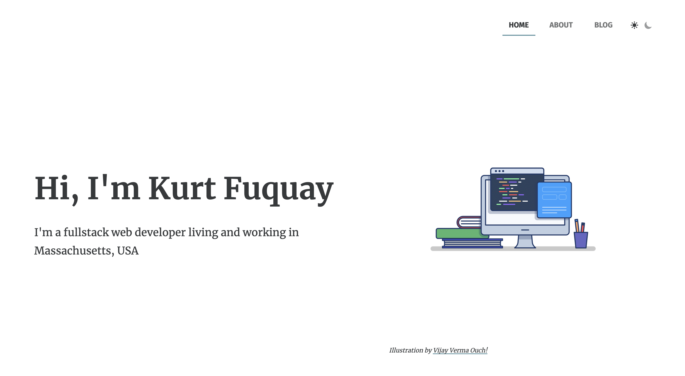

# kfuquay-v1

[](https://astro-blog-template.netlify.app/)

Built with [Astro](https://astro.build/).

Based on [Maxi Ferreira's Astro Blog Template](https://github.com/Charca/astro-blog-template).

---

## Summary

- [Deployment status](#deployment-status)
- [Features](#features)
- [Project Structure](#project-structure)
- [Commands](#commands)

---

## Deployment status

### Production

`main` branch

[](https://app.netlify.com/sites/kfuquay/deploys)

[☝️ Back to the summary](#summary)

---

## Features

- ✅ Astro 5.0
- ✅ Dark Mode
- ✅ Full Markdown support
- ✅ SEO-friendly setup with canonical URLs and OpenGraph data
- ✅ RSS 2.0 generation
- ✅ Sitemap.xml generation

[☝️ Back to the summary](#summary)

---

## Project Structure

```bash
/
├── public/
│   ├── robots.txt
│   └── favicon.ico
├── src/
│   ├── components/
│   │   └── Tour.astro
│   └── pages/
│       └── index.astro
└── package.json
```

Astro looks for `.astro` or `.md` files in the `src/pages/` directory. Each page is exposed as a route based on its file name.

There's nothing special about `src/components/`, but that's where we like to put any Astro/React/Vue/Svelte/Preact components.

Any static assets, like images, can be placed in the `public/` directory.

[☝️ Back to the summary](#summary)

---

## Commands

All commands are run from the root of the project, from a terminal:

| Command           | Action                                       |
| :---------------- | :------------------------------------------- |
| `npm install`     | Installs dependencies                        |
| `npm run dev`     | Starts local dev server at `localhost:3030`  |
| `npm run build`   | Build your production site to `./dist/`      |
| `npm run preview` | Preview your build locally, before deploying |

[☝️ Back to the summary](#summary)
